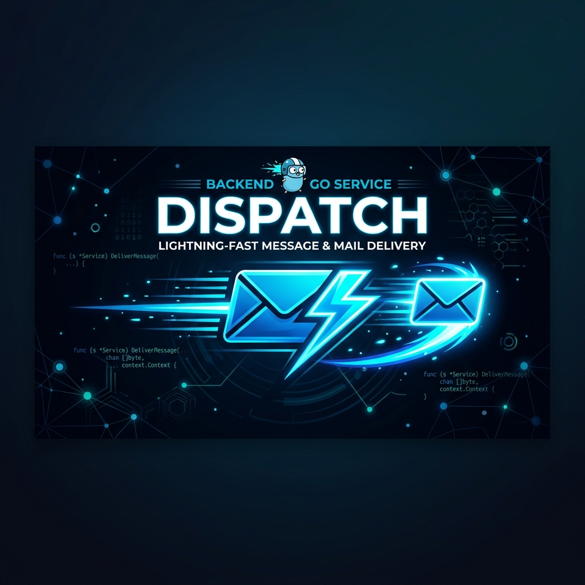

# dispatch


<div align="center">
  
</div>

Multi-tenantes E-Mail-Delivery-System. REST-Eingang → NATS JetStream → Microsoft Graph API.

## Architektur

```
Client
  POST /dispatch/api/v1/mail/send
  └── mail-gateway (7-Stage-Pipeline)
        1. JSON-Decode + Struct-Validierung (Format, Größe, MIME-Whitelist)
        2. Sender-Lookup (NATS KV senders, In-Memory-Cache 10 min)
        3. Domain-Whitelist-Check
        4. Quota-Check (NATS KV quota, rolling 24h, CAS, fail-closed)
        5. Spam-Deduplizierung (SHA-256, NATS KV spam, TTL-Bucket)
        6. Anhang-Upload → NATS Object Store attachments
           ↳ Fehler → HTTP 503 (kein Retry)
        7. Publish → NATS JetStream DISPATCH_MAILS
           ↳ Fehler → HTTP 503 (kein Retry, kein Fallback)
           ↳ Erfolg → HTTP 202

  NATS JetStream
  └── mail-worker (durable Pull-Consumer; AckWait 5m, MaxDeliver 8, InProgress)
        1. JSON-Deserialisierung (→ DISPATCH_DEAD_LETTERS bei Fehler)
        2. Dedup via NATS KV delivered (7-Tage-TTL; vor MaxDeliver-Gate)
        3. MaxDeliver-Gate → DLQ + FAILED + Term (kein Graph)
        4. Anhänge aus NATS Object Store laden
           ↳ Fehler → kein ACK (Redelivery)
        5. Test-Modus: Audit-Eintrag ohne MS-Graph-Call
        6. sendMail / Upload-Session via MS Graph API
           ↳ 429/5xx → kein ACK, JetStream redelivert (InProgress hält AckWait)
                        Retry-After-Header wird ausgewertet (max 30 s)
           ↳ 4xx      → ACK + FAILED in DISPATCH_AUDIT
           ↳ Erfolg   → Put delivered + ACK + DELIVERED audit + Object Store cleanup

  mail-admin    → GraphQL-API: Sender-Verwaltung, Audit-Log, Dead-Letters
  bouncemanagement → MS-Graph-Poller (alle 15 min) → DISPATCH_BOUNCES
```

**State-Backend: ausschließlich NATS** — kein PostgreSQL, kein Redis, kein externes System.

Eine detaillierte Architekturbeschreibung mit Datenfluss-Diagrammen und NATS-Topologie befindet sich in [ARCHITECTURE.md](ARCHITECTURE.md).

## Services

| Service | Endpunkt | Zweck |
|---------|----------|-------|
| `cmd/mail-gateway` | `POST /dispatch/api/v1/mail/send` | HTTP-Eingang, Validierung, Publish |
| `cmd/mail-worker` | — | NATS-Consumer, MS-Graph-Delivery |
| `cmd/mail-admin` | `POST /graphql` | Sender-CRUD, Audit-Abfragen |
| `cmd/bouncemanagement` | — | NDR-Crawler, Bounce-Aufzeichnung |

## NATS-Ressourcen

| Typ | Name | Zweck |
|-----|------|-------|
| KV | `senders` | Sender-Konfiguration (appTag → Email, Quota, Domains) |
| KV | `quota` | Rolling-24h-Verbrauch pro appTag (optimistic CAS) |
| KV | `spam` | SHA-256-Fingerprints mit TTL-Ablauf |
| KV | `delivered` | Dedup-Index für Worker (7-Tage-TTL) |
| Stream | `DISPATCH_MAILS` | Work-Queue (WorkQueuePolicy, 72h Retention) |
| Stream | `DISPATCH_AUDIT` | Delivery-Ergebnisse (DELIVERED / FAILED / TEST_SUCCESS) |
| Stream | `DISPATCH_DEAD_LETTERS` | Nicht-parsbare Nachrichten |
| Stream | `DISPATCH_BOUNCES` | NDR-Ergebnisse aus Bounce-Crawler |
| Object Store | `attachments` | Anhangsdaten entkoppelt vom JetStream-Limit (72h TTL) |

## Konfiguration

### Pflicht (kein Default — Service startet nicht ohne diese)

```
NATS_URL
MS_GRAPH_TENANT_ID      \
MS_GRAPH_CLIENT_ID       } entfallen wenn MS_GRAPH_MOCK_TOKEN gesetzt ist
MS_GRAPH_CLIENT_SECRET  /
MS_GRAPH_SENDER_EMAIL
DISPATCH_ADMIN_AUTH_SECRET   # HMAC-Schlüssel für Admin-API JWT-Auth
DISPATCH_GATEWAY_AUTH_TOKEN  # Bearer-Token für POST /mail/send (Pflicht, außer Auth disabled)
```

### Optional

```
PORT=8080
MS_GRAPH_BOUNCE_MAILBOX           # default: MS_GRAPH_SENDER_EMAIL
MS_GRAPH_MOCK_TOKEN=              # OAuth2 überspringen, Credentials optional (nur Dev)
MS_GRAPH_PROXY_URL=               # Graph-Calls durch Dev Proxy routen (z. B. http://localhost:8000)
DISPATCH_GATEWAY_AUTH_DISABLED=   # true = Send-Auth aus (nur lokaler Dev; nicht in Prod)
DISPATCH_SPAM_TIMEOUT_SECONDS=60
DISPATCH_VALIDATION_MAX_BODY_SIZE=10000000
DISPATCH_VALIDATION_MIME_WHITELIST=application/pdf,image/jpeg,image/png,...
DISPATCH_MAX_TOTAL_ATTACHMENT_SIZE_MB=20
DISPATCH_NATS_PUBLISH_TIMEOUT_SECONDS=5
DISPATCH_GRAPH_RATE_LIMITER_SKIP_SLEEP=false
DISPATCH_WORKER_ACK_WAIT_SECONDS=300   # mail-worker JetStream AckWait (default 5m)
DISPATCH_WORKER_MAX_DELIVER=8          # finite redelivery; -1/0 invalid → default 8
```

## Lokale Entwicklung

```bash
# Voraussetzung: devbox (https://www.jetpack.io/devbox)
devbox shell
```

### Mit echten MS-Graph-Credentials

```bash
devbox run up   # NATS via Docker Compose starten

export $(grep -v '^#' .env.local | xargs)
go run ./cmd/mail-gateway
go run ./cmd/mail-worker
```

Beispiel `.env.local` (nicht einchecken):

```bash
NATS_URL=nats://localhost:4222
MS_GRAPH_TENANT_ID=<azure-tenant-id>
MS_GRAPH_CLIENT_ID=<client-id>
MS_GRAPH_CLIENT_SECRET=<client-secret>
MS_GRAPH_SENDER_EMAIL=noreply-dev@example.com
DISPATCH_GATEWAY_AUTH_TOKEN=dev-token
DISPATCH_SPAM_TIMEOUT_SECONDS=5
DISPATCH_GRAPH_RATE_LIMITER_SKIP_SLEEP=true
```

### Mit MS Graph Developer Proxy (kein Azure-Account erforderlich)

Der [Microsoft Graph Developer Proxy](https://learn.microsoft.com/en-us/microsoft-graph/msgraph-developer-proxy/overview) mockt alle genutzten Graph-Endpunkte lokal.

```bash
devbox run dev-proxy:up # NATS + Dev Proxy (Port 8000) starten
devbox run worker-dev   # Worker mit Mock-Token gegen Dev Proxy
devbox run gateway-dev  # Gateway mit Mock-Token gegen lokales NATS
```

Die Proxy-Konfiguration liegt in [`dev-proxy/devproxyrc.json`](dev-proxy/devproxyrc.json), Mock-Antworten in [`dev-proxy/mocks.json`](dev-proxy/mocks.json).

NATS Monitoring: http://localhost:8222

## Build & Test

```bash
devbox run build             # go build ./...
devbox run test              # alle Unit-Tests
devbox run test-gateway      # nur Gateway
devbox run test-worker       # nur Worker
devbox run lint              # golangci-lint
devbox run coverage          # Tests + Coverage-Bericht (ASCII)
devbox run coverage-html     # Tests + Coverage-Bericht (HTML → coverage.html)
devbox run test-integration  # Integrationstests (Docker erforderlich)
devbox run mutate            # Mutations-Tests (gremlins) für Core-Packages
devbox run metrics           # Coverage + Mutations in einem Lauf
devbox run sonar             # Coverage erzeugen + SonarQube-Scan
```

### Test-Metriken (Stand main)

| Metrik | Wert |
|--------|------|
| Unit-Tests | 241 |
| Mutation Score (alle Core-Packages) | 100 % Efficacy |
| Mutation Score Threshold | ≥ 70 % (efficacy + mutation-coverage) |
| SonarQube Quality Gate | PASSED |

**Coverage pro Package** (Unit-Tests, kein NATS/Docker):

| Package | Coverage | Anmerkung |
|---------|---------|-----------|
| `internal/admin` | 55 % | Resolver + GQL-Typen erfordern NATS; `auth.go` 93 %, Mapper/Filter/Pagination 100 % |
| `internal/bounce` | 93 % | |
| `internal/config` | 98 % | |
| `internal/domain` | 75 % | |
| `internal/gateway` | 78 % | `AttachmentStore.Upload` nur via Integration |
| `internal/loggy` | 100 % | inkl. `MaskEmail` |
| `internal/msgraph` | 92 % | `Service.SendEmail` nur via Integration |
| `internal/natsutil` | 83 % | Embedded nats-server Tests, keine externen Dienste |
| `internal/quota` | 89 % | |
| `internal/sender` | 92 % | |
| `internal/spam` | 100 % | inkl. `Hash` (ehem. `internal/hash`) |
| `internal/worker` | 77 % | Consumer/AttachStore nur via Integration |

Mutation-Tests laufen mit [gremlins](https://github.com/go-gremlins/gremlins) (`go tool gremlins unleash`) auf den Packages `internal/gateway`, `internal/quota`, `internal/spam`, `internal/worker`, `internal/loggy`, `internal/msgraph`, `internal/sender`, `internal/natsutil`, `internal/admin` und `internal/bounce`. Die Schwellwerte sind in [`.gremlins.yaml`](.gremlins.yaml) hinterlegt.

Statische Code-Analyse via [SonarQube](http://10.27.27.202:9000/dashboard?id=dispatch). Token wird aus `.env` geladen (`SONAR_TOKEN=sqp_...`), nie im Repository gespeichert.

## API

### Mail senden

Erfordert `Authorization: Bearer <DISPATCH_GATEWAY_AUTH_TOKEN>` (Health-Endpunkte ohne Auth).
Gateway nicht öffentlich exponieren — Token ist Defense-in-Depth, nicht Ersatz für Netzwerk-Isolation.
`mail-gateway` startet ohne Token nur mit `DISPATCH_GATEWAY_AUTH_DISABLED=true` (nur lokaler Dev).

```
POST /dispatch/api/v1/mail/send
Content-Type: application/json
Authorization: Bearer <DISPATCH_GATEWAY_AUTH_TOKEN>

{
  "appTag": "sunshine-app",
  "recipients": ["user@example.com"],
  "ccRecipients": [],
  "bccRecipients": [],
  "subject": "Hello",
  "bodyContent": "Plain text body",
  "htmlBodyContent": "<p>HTML body</p>",
  "attachments": [
    {
      "name": "file.pdf",
      "mimeType": "application/pdf",
      "content": "<base64>"
    }
  ],
  "traceContext": {}
}
```

**Antworten:**

| Status | Bedeutung |
|--------|-----------|
| `202` | Nachricht an NATS übergeben |
| `400` | Validierungsfehler (Pflichtfelder, Domain, Spam, MIME) |
| `401` | Fehlendes oder ungültiges Gateway-Token |
| `413` | Request-Body überschreitet Größenlimit (`DISPATCH_VALIDATION_MAX_BODY_SIZE`) |
| `429` | Tages-Quota überschritten (`X-RateLimit-Limit`, `X-RateLimit-Remaining`) |
| `503` | NATS nicht erreichbar, Quota-State-Fehler oder Attachment-Upload fehlgeschlagen |

### Health

```
GET /health        → {"status":"UP","checks":[...]}
GET /health/live   → 200
GET /health/ready  → 200
```

### Admin GraphQL

Alle Requests an `/graphql` erfordern einen gültigen JWT im Header:
```
Authorization: Bearer <token>
```
Token: HMAC-SHA256, signiert mit `DISPATCH_ADMIN_AUTH_SECRET`, `exp`-Claim erforderlich.

```
POST /graphql

# Sender anlegen
mutation {
  createSender(input: {
    appTag: "sunshine-app"
    email: "noreply@example.com"
    test: false
    dailyQuota: 1000
    allowedDomains: "example.com,partner.de"
  }) { appTag email dailyQuota }
}

# Audit-Log abfragen
query {
  mails(filter: { appTag: "sunshine-app", status: "DELIVERED" }, page: 0, size: 20) {
    total
    items { traceId status timestamp recipients }
  }
}
```

## Resilience-Verhalten

| Fehlerfall | Verhalten |
|------------|-----------|
| NATS beim Publish nicht erreichbar | HTTP 503, kein Retry im Gateway |
| Quota KV-Fehler | HTTP 503 (fail-closed, niemals bypass) |
| Attachment-Upload fehlgeschlagen | HTTP 503, kein Retry im Gateway |
| MS Graph 429 / 5xx | Kein NATS-ACK, JetStream redelivert; InProgress hält AckWait (default 5m); `Retry-After` max 30 s |
| MaxDeliver erschöpft (default 8) | DLQ + FAILED Audit + Term; kein Graph; Dedup vor MaxDeliver-Gate |
| MS Graph 4xx (außer 429) | ACK, FAILED in Audit |
| JSON-Parse-Fehler im Worker | ACK, Dead-Letter-Stream |
| Worker-Absturz nach Graph-Erfolg | Dedup via KV `delivered` verhindert Doppelversand |
| Worker-Absturz vor Object-Store-Cleanup | 72h-TTL bereinigt verwaiste Anhangsdaten |
| E-Mail-Adressen in Logs | Immer maskiert: `u***@domain.com` |

## Stack

- **Go 1.25+**
- **NATS JetStream** — Message-Broker, KV-Store, Object Store, State-Backend
- **Microsoft Graph API v1.0** — E-Mail-Versand via Microsoft 365
- **`github.com/go-chi/chi/v5`** — HTTP-Routing
- **`github.com/go-playground/validator/v10`** — Request-Validierung
- **`github.com/nats-io/nats.go`** — NATS-Client
- **`github.com/sony/gobreaker`** — Circuit Breaker (MS Graph)
- **`golang.org/x/time/rate`** — Token-Bucket-Rate-Limiter pro Sender
- **`github.com/graph-gophers/graphql-go`** — GraphQL (Admin-API)
- **`internal/loggy`** — Loggy Core 1.3.0-kompatibler JSON-Logging-Wrapper (`GetLogger`, semantische Kategorien, API-Tracking)
