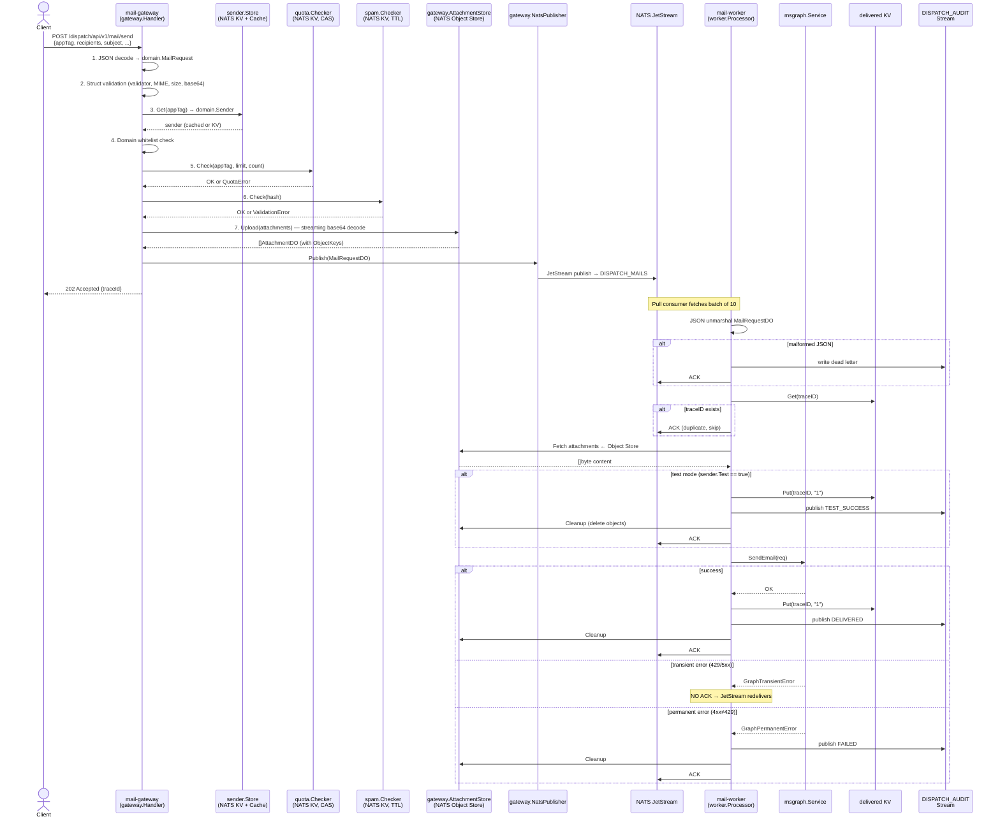
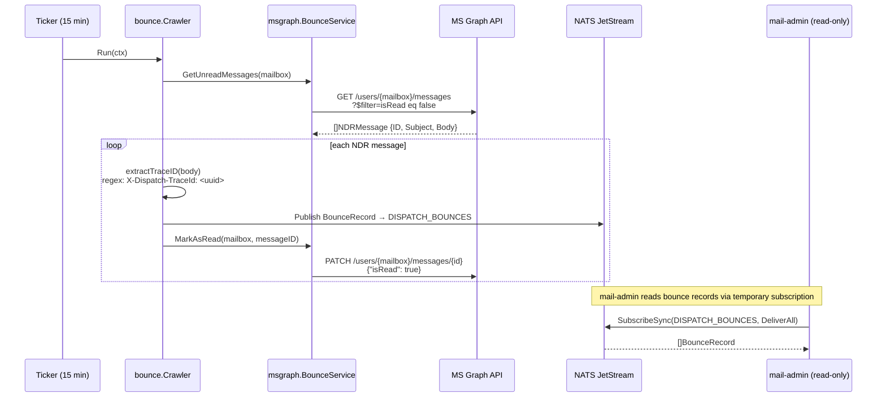

# Data Flows

## Happy Path: Send Mail

## Bounce Detection

## Key Data Transformations

| Transform | Where | Input → Output |
|---|---|---|
| `MailRequest` → `MailRequestDO` | mail-gateway handler | Inline attachment base64 → Object Store keys; adds traceID, sender email, test flag |
| `AttachmentDO` (ObjectKey) → `AttachmentDO` (Content) | mail-worker processor | Object Store → []byte; `json:"-"` field populated at runtime |
| Base64 → raw bytes (streaming) | gateway attachment upload | `base64.NewDecoder` → writes directly to Object Store (O(1) memory) |
| MS Graph JSON → `domain.AuditRecord` | mail-worker processor | Delivery outcome marshaled to NATS stream message |
| NDR body → `X-Dispatch-TraceId` | bounce crawler | Regex extraction: `X-Dispatch-TraceId:\s*([0-9a-f-]{36})` |
