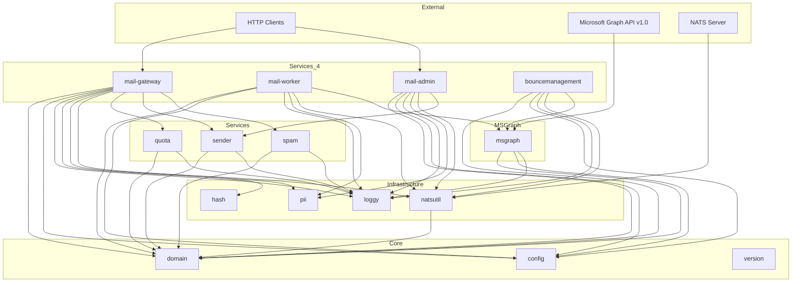

# Dependencies

## Global Dependency Graph

## NATS Resource Ownership

| NATS Resource | Type | Written By | Read By |
|---|---|---|---|
| `DISPATCH_MAILS` (subject: `cody.mailing.job.request.mails`) | Stream (WorkQueue, 72h TTL) | mail-gateway, mail-admin (reprocess) | mail-worker |
| `DISPATCH_AUDIT` (subject: `cody.mailing.audit`) | Stream (30d TTL) | mail-worker | mail-admin |
| `DISPATCH_DEAD_LETTERS` (subject: `cody.mailing.deadletter`) | Stream (30d TTL) | mail-worker | mail-admin |
| `DISPATCH_BOUNCES` (subject: `cody.mailing.bounce`) | Stream (30d TTL) | bouncemanagement | mail-admin |
| `senders` | KV Bucket | mail-admin | mail-gateway (with cache), mail-admin |
| `quota` | KV Bucket (25h TTL) | mail-gateway | mail-gateway |
| `spam` | KV Bucket (configurable TTL) | mail-gateway | mail-gateway |
| `delivered` | KV Bucket (7d TTL) | mail-worker | mail-worker |
| `attachments` | Object Store (72h TTL) | mail-gateway | mail-worker (fetch), mail-worker (delete) |

## External Dependencies (Go Modules)

| Module | Purpose |
|---|---|
| `github.com/go-chi/chi/v5` | HTTP routing |
| `github.com/go-playground/validator/v10` | Struct validation |
| `github.com/nats-io/nats.go` | NATS client (JetStream, KV, Object Store) |
| `github.com/golang-jwt/jwt/v5` | JWT auth for admin API |
| `github.com/google/uuid` | Trace ID generation |
| `github.com/graph-gophers/graphql-go` | GraphQL server for admin API |
| `github.com/sony/gobreaker` | Circuit breaker for MS Graph calls |
| `golang.org/x/time/rate` | Token-bucket rate limiter |

## External Services

| Service | Protocol | Purpose |
|---|---|---|
| Microsoft Graph API v1.0 | HTTPS REST | Email delivery, bounce mailbox polling |
| Microsoft Identity Platform | OAuth2 (client credentials) | Token acquisition for MS Graph |
| NATS Server | NATS protocol | Message broker, KV store, object store |
