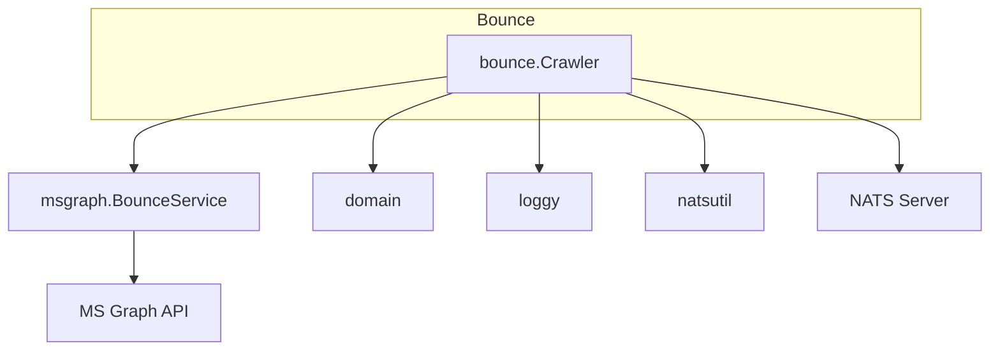

# bounce-management: Dependencies

## Depends On (Outbound)

| Dependency | Type | Purpose | Import Path |
|---|---|---|---|
| `config` | Internal package | Load Config from env vars (bounce mailbox address) | `dispatch/internal/config` |
| `domain` | Internal package | BounceRecord type | `dispatch/internal/domain` |
| `loggy` | Internal util | Structured logging | `dispatch/internal/loggy` |
| `natsutil` | Internal util | NATS subject name constant (`SubjectBounce`) | `dispatch/internal/natsutil` |
| `nats.go` | Go module | JetStream context for publishing | `github.com/nats-io/nats.go` |
| `msgraph.BounceService` | Internal client | GetUnreadMessages, MarkAsRead | `dispatch/internal/msgraph` (implements `graphClient` interface) |
| NATS Server | External service | JetStream publish to `DISPATCH_BOUNCES` | network |
| MS Graph API | External service | Mailbox polling (via msgraph.BounceService) | HTTPS |

## NATS Resources Accessed

| Resource | Operation | Via |
|---|---|---|
| `DISPATCH_BOUNCES` (stream) | Publish | `jsPublisher.Publish(natsutil.SubjectBounce, ...)` |

## Depended On By (Inbound)

| Dependent | Type | Purpose |
|---|---|---|
| mail-admin | Internal (indirect) | Reads bounce records from `DISPATCH_BOUNCES` for GraphQL queries |

## Consumer-Side Interface (defined in `internal/bounce`)

```go
type graphClient interface {
    GetUnreadMessages(ctx context.Context, mailbox string) ([]NDRMessage, error)
    MarkAsRead(ctx context.Context, mailbox, messageID string) error
}

type jsPublisher interface {
    Publish(subj string, data []byte, opts ...nats.PubOpt) (*nats.PubAck, error)
}
```

Both interfaces are intentionally narrow — makes the crawler testable without real NATS or MS Graph.

## Dependency Graph


