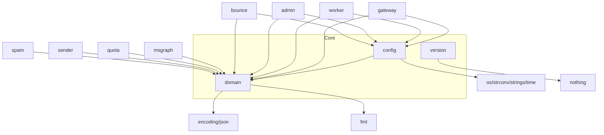

# core: Dependencies

## Depends On (Outbound)

| Dependency | Type | Purpose |
|---|---|---|
| `encoding/json` | Go stdlib | Struct tags |
| `fmt` | Go stdlib | Error formatting |
| `os`, `strconv`, `strings` | Go stdlib | Env var loading in config |
| `time` | Go stdlib | Duration type in config |
| `github.com/go-playground/validator/v10` | Go module | Struct validation tags (indirect — only in import for tags) |

## Used By (Everything depends on core)

| Consumer | Uses |
|---|---|
| `internal/gateway/` | `MailRequest`, `MailRequestDO`, `AttachmentDO`, `Sender`, `ApiError`, `ValidationError`, `QuotaError`, `QuotaStateError`, `NatsPublishError` |
| `internal/worker/` | `MailRequestDO`, `AttachmentDO`, `AuditRecord`, `DeadLetter` |
| `internal/admin/` | `Sender`, `AuditRecord`, `BounceRecord`, `DeadLetter` |
| `internal/bounce/` | `BounceRecord` |
| `internal/msgraph/` | `MailRequestDO`, `AttachmentDO` |
| `internal/quota/` | `QuotaError`, `QuotaStateError` |
| `internal/sender/` | `Sender`, `ValidationError` |
| `internal/spam/` | `ValidationError` |
| `cmd/*/main.go` | `Config`, `Version` |

## Dependency Graph

