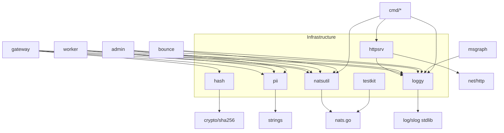

# infrastructure: Dependencies

## Depends On (Outbound)

| Package | Depends On | Type |
|---|---|---|
| `loggy` | `log/slog`, `sync`, `os`, `time` | Go stdlib only |
| `natsutil` | `github.com/nats-io/nats.go`, `time` | Go module + stdlib |
| `httpsrv` | `net/http`, `context`, `internal/loggy` | stdlib + loggy |
| `testkit` | `github.com/nats-io/nats.go`, `time` | Go module + stdlib (test-only) |
| `hash` | `crypto/sha256`, `fmt`, `strings` | Go stdlib only |
| `pii` | `strings` | Go stdlib only |

## Used By

| Consumer | Uses |
|---|---|
| `internal/gateway/` | loggy, natsutil, hash, pii |
| `internal/worker/` | loggy, natsutil, pii |
| `internal/admin/` | loggy, natsutil, pii |
| `internal/bounce/` | loggy, natsutil |
| `internal/msgraph/` | loggy |
| `cmd/mail-gateway`, `cmd/mail-admin` | loggy, natsutil, httpsrv |
| `cmd/mail-worker`, `cmd/bouncemanagement` | loggy, natsutil |
| unit tests (admin, quota, sender, spam, worker, …) | testkit |

Note: `quota`, `sender`, and `spam` do **not** import loggy; they return typed domain errors and leave logging to callers.

## Dependency Graph

