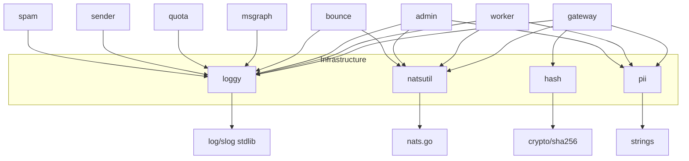

# infrastructure: Dependencies

## Depends On (Outbound)

| Package | Depends On | Type |
|---|---|---|
| `loggy` | `log/slog`, `sync`, `os`, `time` | Go stdlib only |
| `natsutil` | `github.com/nats-io/nats.go`, `time` | Go module + stdlib |
| `hash` | `crypto/sha256`, `fmt`, `strings` | Go stdlib only |
| `pii` | `strings` | Go stdlib only |

## Used By (Everything)

| Consumer | Uses |
|---|---|
| `internal/gateway/` | loggy, natsutil, hash, pii |
| `internal/worker/` | loggy, natsutil, pii |
| `internal/admin/` | loggy, natsutil, pii |
| `internal/bounce/` | loggy, natsutil |
| `internal/msgraph/` | loggy |
| `internal/quota/` | loggy |
| `internal/sender/` | loggy |
| `internal/spam/` | loggy |
| `cmd/*/main.go` | loggy, natsutil |

## Dependency Graph

