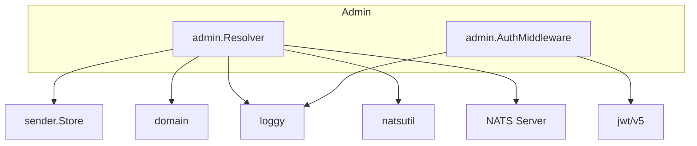

# mail-admin: Dependencies

## Depends On (Outbound)

| Dependency | Type | Purpose | Import Path |
|---|---|---|---|
| `config` | Internal package | Load Config from env vars | `dispatch/internal/config` |
| `domain` | Internal package | Sender, AuditRecord, BounceRecord, DeadLetter types | `dispatch/internal/domain` |
| `sender` | Internal service | Sender CRUD on NATS KV | `dispatch/internal/sender` |
| `loggy` | Internal util | Structured logging | `dispatch/internal/loggy` |
| `natsutil` | Internal util | Stream/consumer/subject name constants | `dispatch/internal/natsutil` |
| `nats.go` | Go module | JetStream context, KV operations | `github.com/nats-io/nats.go` |
| `jwt/v5` | Go module | JWT validation | `github.com/golang-jwt/jwt/v5` |
| `graphql-go` | Go module | GraphQL server | `github.com/graph-gophers/graphql-go` |
| NATS Server | External service | KV read/write, stream subscriptions | network |

## NATS Resources Accessed

| Resource | Operation | Via |
|---|---|---|
| `senders` (KV) | Read, Write, Delete, List | `sender.Store` |
| `DISPATCH_AUDIT` (stream) | Read (temporary sub) | `Resolver.readAuditStream()` |
| `DISPATCH_BOUNCES` (stream) | Read (temporary sub) | `Resolver.readBounceStream()` |
| `DISPATCH_DEAD_LETTERS` (stream) | Read (temporary sub) | `Resolver.readDeadLetterStream()` |
| `DISPATCH_MAILS` (stream) | Publish (reprocess only) | `Resolver.ReprocessDeadLetter()` |

## Depended On By (Inbound)

| Dependent | Type | Purpose |
|---|---|---|
| Admin clients / tools | HTTP/GraphQL | Manage senders, view audit/bounce/dead-letter data |
| `tools/gen-admin-token/` | CLI tool | Token generation (separate binary, not an import) |

## Dependency Graph

