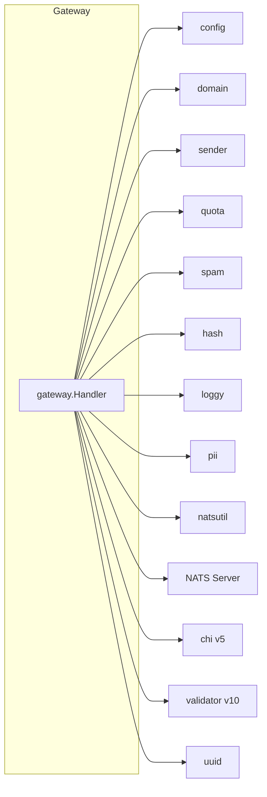

# mail-gateway: Dependencies

## Depends On (Outbound)

| Dependency | Type | Purpose | Import Path |
|---|---|---|---|
| `config` | Internal package | Load Config from env vars | `dispatch/internal/config` |
| `domain` | Internal package | MailRequest, MailRequestDO, Sender, error types | `dispatch/internal/domain` |
| `sender` | Internal service | Lookup sender config (KV + cache) | `dispatch/internal/sender` |
| `quota` | Internal service | Rolling 24h quota check (CAS) | `dispatch/internal/quota` |
| `spam` | Internal service | SHA-256 spam dedup | `dispatch/internal/spam` |
| `hash` | Internal util | SHA-256 hash computation | `dispatch/internal/hash` |
| `loggy` | Internal util | Structured logging | `dispatch/internal/loggy` |
| `pii` | Internal util | Email masking | `dispatch/internal/pii` |
| `natsutil` | Internal util | NATS subject/stream names | `dispatch/internal/natsutil` |
| `nats.go` | Go module | NATS JetStream, Object Store | `github.com/nats-io/nats.go` |
| `chi/v5` | Go module | HTTP router | `github.com/go-chi/chi/v5` |
| `validator/v10` | Go module | Struct validation | `github.com/go-playground/validator/v10` |
| `uuid` | Go module | Trace ID generation | `github.com/google/uuid` |
| NATS Server | External service | JetStream publish, KV read, Object Store put | network |

## NATS Resources Accessed

| Resource | Operation | Via |
|---|---|---|
| `DISPATCH_MAILS` (stream) | Publish | `NatsPublisher.Publish()` |
| `senders` (KV) | Read (with cache) | `sender.Store.Get()` |
| `quota` (KV) | Read/Write (CAS) | `quota.Checker.Check()` |
| `spam` (KV) | Read/Write | `spam.Checker.Check()` |
| `attachments` (Object Store) | Put | `AttachmentStore.Upload()` |

## Depended On By (Inbound)

| Dependent | Type | Purpose |
|---|---|---|
| External HTTP clients | HTTP | Send mail requests |
| Kubernetes / load balancer | HTTP | Health checks |
| mail-admin | Internal (indirect) | None — mail-admin reads from NATS directly; gateway has no dependency relationship with admin |

## Dependency Graph

