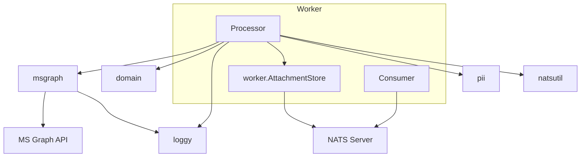

# mail-worker: Dependencies

## Depends On (Outbound)

| Dependency | Type | Purpose | Import Path |
|---|---|---|---|
| `config` | Internal package | Load Config from env vars | `dispatch/internal/config` |
| `domain` | Internal package | MailRequestDO, AuditRecord, DeadLetter, status constants | `dispatch/internal/domain` |
| `msgraph` | Internal client | SendEmail(), error types (GraphTransientError, GraphPermanentError) | `dispatch/internal/msgraph` |
| `loggy` | Internal util | Structured logging | `dispatch/internal/loggy` |
| `pii` | Internal util | Email masking | `dispatch/internal/pii` |
| `natsutil` | Internal util | NATS subject/stream names, consumer name | `dispatch/internal/natsutil` |
| `nats.go` | Go module | JetStream context, KV, Object Store, messages | `github.com/nats-io/nats.go` |
| NATS Server | External service | JetStream consume, KV read/write, Object Store get/delete | network |
| MS Graph API | External service | Email delivery | HTTPS |

## NATS Resources Accessed

| Resource | Operation | Via |
|---|---|---|
| `DISPATCH_MAILS` (stream) | Consume (pull) | `Consumer.Run()` → `js.PullSubscribe()` |
| `DISPATCH_AUDIT` (stream) | Publish | `Processor.writeAudit()` |
| `DISPATCH_DEAD_LETTERS` (stream) | Publish | `Processor.writeDeadLetter()` |
| `delivered` (KV) | Get, Put | `Processor.Handle()` |
| `attachments` (Object Store) | Get, Delete | `worker.AttachmentStore.Fetch()`, `Cleanup()` |

## Depended On By (Inbound)

| Dependent | Type | Purpose |
|---|---|---|
| NATS JetStream | Message broker | Delivers messages from `DISPATCH_MAILS` to the durable consumer |
| mail-admin | Internal (indirect) | Reads audit records written by worker; reads dead letters written by worker |

## Dependency Graph

