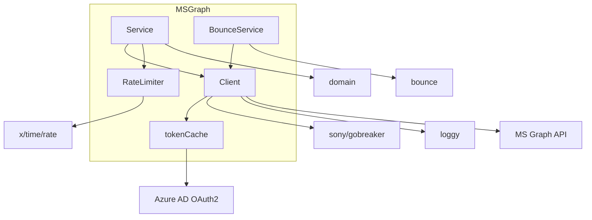

# msgraph: Dependencies

## Depends On (Outbound)

| Dependency | Type | Purpose |
|---|---|---|
| `domain` | Internal package | `MailRequestDO` type used in `SendEmail()` |
| `bounce` | Internal package | `NDRMessage` type returned by `BounceService` |
| `loggy` | Internal util | Structured logging with API tracking |
| `net/http` | Go stdlib | HTTP client |
| `github.com/sony/gobreaker` | Go module | Circuit breaker |
| `golang.org/x/time/rate` | Go module | Token bucket rate limiter |
| Microsoft Graph API v1.0 | External service | Email send, bounce mailbox polling |
| Microsoft Identity Platform | External service | OAuth2 token endpoint |

## Used By (Who depends on this module)

| Consumer | Type | Uses |
|---|---|---|
| `internal/worker/processor.go` | Internal | `emailSender` interface → `msgraph.Service.SendEmail()` |
| `internal/bounce/crawler.go` | Internal | `graphClient` interface → `msgraph.BounceService.GetUnreadMessages()`, `MarkAsRead()` |
| `cmd/mail-worker/main.go` | Binary entry | Constructs `msgraph.NewClient()`, `msgraph.NewService()`, `msgraph.NewRateLimiter()` |
| `cmd/bouncemanagement/main.go` | Binary entry | Constructs `msgraph.NewBounceService()` |

## Dependency Graph

