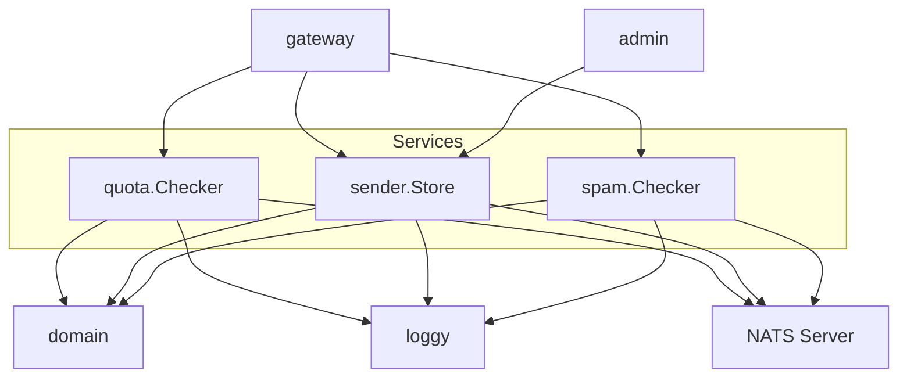

# services: Dependencies

## Depends On (Outbound)

| Service | Internal Deps | Go Modules | External |
|---|---|---|---|
| `quota` | `domain` (QuotaError, QuotaStateError), `loggy` | `nats.go` (KV, JetStreamError) | NATS Server |
| `sender` | `domain` (Sender, ValidationError), `loggy` | `nats.go` (KV) | NATS Server |
| `spam` | `domain` (ValidationError, ErrorCode), `loggy` | `nats.go` (KV) | NATS Server |

## Used By

| Service | Used By | How |
|---|---|---|
| `quota.Checker` | `internal/gateway/` | `quotaChecker` interface → `Check()`, `CurrentUsage()` |
| `sender.Store` | `internal/gateway/` | `senderLookup` interface → `Get()` |
| `sender.Store` | `internal/admin/` | Direct import → `Get()`, `Put()`, `Delete()`, `List()` |
| `spam.Checker` | `internal/gateway/` | `spamChecker` interface → `Check()` |

## Dependency Graph

